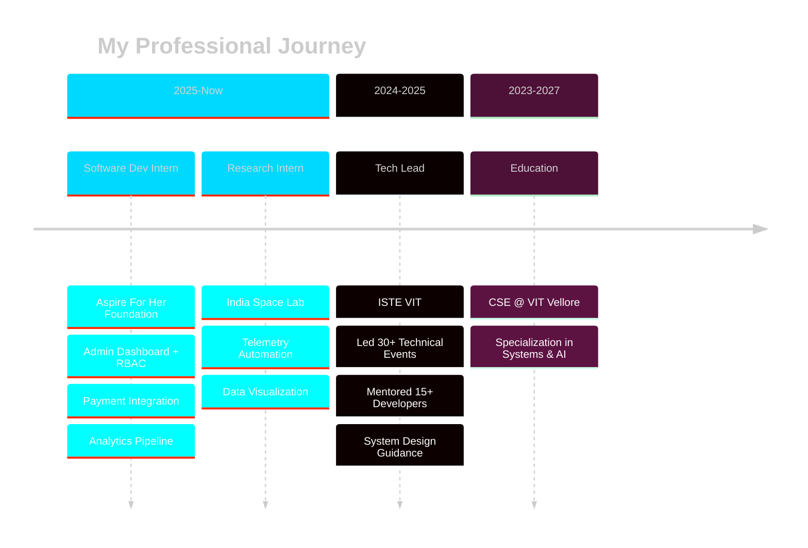

<div align="center">

#  ARJIT TRIPATHI

<p align="center">
  
</p>


**`Building production systems that matter`** × **`Not just another developer`**

<br/>

[](https://arjittripathi.vercel.app)
[](https://www.linkedin.com/in/arjit-tripathi-213b4a292/)
[](mailto:arjittripathi3103@gmail.com)


</div>

<br/>


## 🎯 WHO AM I


```typescript
const arjit = {
    identity: {
        role: "Full-Stack System Architect",
        status: "CSE @ VIT Vellore (2023-2027)",
        current: "Software Dev Intern @ Aspire For Her"
    },
    
    mindset: {
        philosophy: "I build systems that solve real problems",
        approach: "Engineering × Logic × Impact",
        goal: "Create production-grade solutions, not demos"
    },
    
    interests: [
        "Distributed Systems",
        "AI/ML Engineering", 
        "Quantitative Problem Solving",
        "System Architecture"
    ],
    
    currently_building: [
        "🧬 MediTrace: Anti-counterfeit drug platform",
        "🏗️ Advanced backend architectures",
        "🧠 Algorithmic thinking muscle"
    ]
};
```

<br clear="right"/>


## ⚡ TECH STACK

<div align="center">

### 💻 Languages


### 🎨 Frontend Universe


### ⚙️ Backend & APIs


### 🛠️ DevOps & Tools


### 🤖 AI/ML


</div>


## 🚀 FLAGSHIP PROJECTS

<div align="center">

<table>
<tr>
<td width="50%">

<div align="center">

### 🧬 MediTrace


**Anti-Counterfeit Drug Verification Platform**

Production-ready system fighting pharmaceutical fraud through cryptographic serialization and AI-powered anomaly detection.

`FastAPI` `React` `Cryptography` `Blockchain-Ledger` `ML`

**[→ Explore Project](https://github.com/omni-ar)**

</div>

</td>
<td width="50%">

<div align="center">

### 🤖 OA Reminder


**AI-Powered Interview Practice System**

Intelligent automation platform with ML-driven question generation, scheduling, and progress tracking via Telegram.

`FastAPI` `Docker` `n8n` `HuggingFace` `Telegram API`

**[→ Explore Project](https://github.com/omni-ar)**

</div>

</td>
</tr>

<tr>
<td width="50%">

<div align="center">

### ⏳ Time Travel Web App


**Interactive 3D Historical Timeline**

Immersive journey through 1000 years (1100-2100 CE) with stunning 3D visualizations and full authentication system.

`React` `Three.js` `JWT Auth` `Payment Gateway` `Full-Stack`

**[→ Explore Project](https://github.com/omni-ar)**

</div>

</td>
<td width="50%">

<div align="center">

### 🔥 More Projects


**System-Level Solutions**

From automation pipelines to data visualization, always focused on architectural excellence and real-world impact.

`System Design` `Automation` `Data Engineering` `Cloud`

**[→ View All Repos](https://github.com/omni-ar?tab=repositories)**

</div>

</td>
</tr>
</table>

</div>


## 💼 PROFESSIONAL TIMELINE



<details>
<summary><b>🔥 Click to see detailed experience</b></summary>

### 💼 Software Development Intern @ Aspire For Her Foundation
**Dec 2025 - Present**

- 🏗️ Architecting enterprise-grade admin dashboard with RBAC
- 💳 Integrating Cashfree payment gateway for seamless transactions
- 📊 Building real-time analytics pipeline for data-driven insights
- ⚡ Optimizing backend performance & database query efficiency

---

### 🛰️ Research Intern @ India Space Lab (Remote)
**Jun 2025 - Jul 2025**

- 🤖 Automated telemetry data collection workflows
- 📈 Developed interactive visualization dashboards
- 📝 Produced comprehensive technical documentation

---

### 👥 Tech Lead @ ISTE VIT
**Aug 2024 - May 2025**

- 🎯 Led technical execution for 30+ high-impact events
- 🧑‍🏫 Mentored 15+ junior developers in modern practices
- 🔧 Established Git workflows and coding standards

</details>


## 📊 GITHUB ANALYTICS

<div align="center">


</div>


## 🎯 WHAT SETS ME APART

<div align="center">

<table>
<tr>
<td align="center" width="33%">
<br>
<b>Production Mindset</b><br>
<sub>I don't build demos<br>I ship real systems</sub>
</td>
<td align="center" width="33%">
<br>
<b>System Architecture</b><br>
<sub>Scalable, maintainable<br>engineering solutions</sub>
</td>
<td align="center" width="33%">
<br>
<b>Problem Solver</b><br>
<sub>Combining engineering<br>with quant-style logic</sub>
</td>
</tr>
</table>

</div>


## 💭 PHILOSOPHY

<div align="center">

> ### *कर्मण्येवाधिकारस्ते मा फलेषु कदाचन।*
> ### *You have the right to perform your duty, but not to the fruits of your actions.*
> **— Bhagavad Gita 2.47**

<br>

**My Interpretation:** Focus on building exceptional systems with complete dedication, without being attached to recognition or outcomes. The quality of work speaks for itself.

<br>

```diff
+ Clean Architecture  + Scalable Design  + Real-World Impact
+ Continuous Learning  + Pragmatic Solutions  + System Thinking
```

</div>


## 🤝 LET'S CONNECT

<div align="center">

I'm always open to collaborating on projects that combine **technical depth** with **meaningful impact**.

**Open for:** `Full-Stack Projects` • `System Design Discussions` • `Open Source` • `Quant Challenges`

<br>

<a href="https://arjittripathi.vercel.app">
  
</a>
<a href="https://www.linkedin.com/in/arjit-tripathi-213b4a292/">
  
</a>
<a href="mailto:arjittripathi3103@gmail.com">
  
</a>
<a href="https://github.com/omni-ar">
  
</a>

<br><br>


<br>

**⭐ If you find my work interesting, consider starring some repos!**

<br>

<sub>Last Updated: February 2026 | Crafted with 💻 and ☕</sub>

</div>


