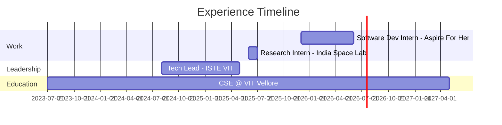

<!-- <div align="center">
  
</div>

<p align="center">
  
</p>

<p align="center">
  
</p>

---

<h2 align="center">🚀 About Me</h2>

<p align="center">
🎓 CSE Undergrad @ <b>VIT Vellore</b> (2023–2027) <br>
💻 Software Development Intern @ <b>Aspire For Her Foundation</b> <br>
🧠 Interested in <b>Full-Stack Systems, AI/ML & Quant-style problem solving</b> <br>
⚙️ I enjoy building systems that combine <b>engineering, logic & real-world impact</b>
</p>

---

<h2 align="center">🧰 Tech Stack</h2>

<p align="center">
  
  <br/>
  
</p>

---

<h2 align="center">📌 Featured Projects</h2>

<p align="center">
<b>🧬 MediTrace</b> — Anti-Counterfeit Drug Verification Platform <br>
FastAPI • React • Cryptographic Serialization • Blockchain-inspired Ledger • AI Anomaly Detection
</p>

<p align="center">
<b>🤖 OA Reminder</b> — AI-Powered Interview Practice System <br>
FastAPI • Docker • n8n • Telegram Bot • HuggingFace Transformers
</p>

<p align="center">
<b>⏳ Time Travel Web App</b> — Interactive 3D Timeline (1100–2100 CE) <br>
React • Three.js • JWT Authentication • Payments • Full-Stack Deployment
</p>

---

<h2 align="center">💼 Experience</h2>

<p align="center">
<b>Software Development Intern — Aspire For Her Foundation</b><br>
<i>Dec 2025 – Present</i><br>
Admin Dashboard • RBAC • Cashfree Integration • Analytics • Backend Optimization
</p>

<p align="center">
<b>Research Intern — India Space Lab (Remote)</b><br>
<i>Jun 2025 – Jul 2025</i><br>
Telemetry Automation • Data Visualization • Technical Reporting
</p>

<p align="center">
<b>Tech Lead — ISTE VIT</b><br>
<i>Aug 2024 – May 2025</i><br>
Led technical execution for 30+ events • Mentored 15+ juniors • Git/GitHub & system design guidance
</p>

---

<h2 align="center">📚 Currently Working On</h2>

<p align="center">
🔹 <b>MediTrace</b> — cryptographic drug serialization & AI-powered counterfeit detection <br>
🔹 Advanced backend architecture & system design <br>
🔹 Consistent DSA & problem-solving practice
</p>

---

<h2 align="center">📊 GitHub Stats</h2>

<p align="center">
  
  &nbsp;&nbsp;
  
</p>

<p align="center">
  
</p>

---

<h2 align="center">🌐 Let's Connect</h2>

<p align="center">
  <a href="https://www.linkedin.com/in/arjit-tripathi-213b4a292/" target="_blank">
    
  </a>
  <a href="https://github.com/omni-ar" target="_blank">
    
  </a>
  <a href="mailto:arjittripathi3103@gmail.com">
    
  </a>
  <a href="https://arjittripathi.vercel.app">
    
  </a>
</p>

---

<h3 align="center">🧠 “I like building systems that actually solve problems — not just demos.”</h3>

<p align="center">
  
</p> -->


<div align="center">

```ascii
╔═══════════════════════════════════════════════════════════════════╗
║                                                                   ║
║     █████╗ ██████╗      ██╗██╗████████╗    ████████╗            ║
║    ██╔══██╗██╔══██╗     ██║██║╚══██╔══╝    ╚══██╔══╝            ║
║    ███████║██████╔╝     ██║██║   ██║          ██║               ║
║    ██╔══██║██╔══██╗██   ██║██║   ██║          ██║               ║
║    ██║  ██║██║  ██║╚█████╔╝██║   ██║          ██║               ║
║    ╚═╝  ╚═╝╚═╝  ╚═╝ ╚════╝ ╚═╝   ╚═╝          ╚═╝               ║
║                                                                   ║
║         Full-Stack Engineer × System Architect × Builder         ║
║                                                                   ║
╚═══════════════════════════════════════════════════════════════════╝
```

<br>

**`CSE @ VIT Vellore`** × **`Software Dev Intern @ Aspire For Her`** × **`Ex-Tech Lead @ ISTE VIT`**

<br>

[](https://arjittripathi.vercel.app)
[](https://www.linkedin.com/in/arjit-tripathi-213b4a292/)
[](mailto:arjittripathi3103@gmail.com)


</div>

---

## 🎯 Current Focus

```python
class ArjitTripathi:
    def __init__(self):
        self.role = "Full-Stack Engineer"
        self.education = "CSE @ VIT Vellore (2023-2027)"
        self.current_work = [
            "Building production-grade anti-counterfeit drug platform",
            "Deep-diving into distributed systems & advanced backend architecture",
            "Sharpening algorithmic thinking through consistent problem-solving"
        ]
        
    def what_drives_me(self):
        return {
            "philosophy": "Building systems that solve real problems, not just demos",
            "interests": ["System Design", "AI/ML Engineering", "Quant-Style Logic"],
            "approach": "Engineering + Logic + Impact"
        }
```

---

## 🛠️ Technical Arsenal

<div align="center">

### Core Stack


### Frontend


### Backend & Infrastructure


### DevOps & Tools


</div>

---

## 🚀 Featured Projects

<table>
<tr>
<td width="50%" valign="top">

### 🧬 MediTrace
**Anti-Counterfeit Drug Verification Platform**

Production-ready system combining cryptographic serialization with AI-powered anomaly detection to combat pharmaceutical counterfeiting.

**Tech:** FastAPI • React • Cryptographic Hashing • Blockchain-inspired Ledger • ML-based Fraud Detection

🔗 [View Project](https://github.com/omni-ar/MediTrace)

</td>
<td width="50%" valign="top">

### 🤖 OA Reminder
**AI-Powered Interview Practice System**

Automated interview preparation platform with intelligent scheduling, question generation, and progress tracking via Telegram integration.

**Tech:** FastAPI • Docker • n8n Automation • HuggingFace Transformers • Telegram Bot API

🔗 [View Project](https://github.com/omni-ar/OA-Reminder)

</td>
</tr>

<tr>
<td width="50%" valign="top">

### ⏳ Time Travel Web App
**Interactive 3D Historical Timeline**

Immersive journey through 1000 years of history (1100-2100 CE) with 3D visualizations, user authentication, and monetization.

**Tech:** React • Three.js • JWT Auth • Payment Integration • Full-Stack Deployment

🔗 [View Project](https://github.com/omni-ar/time-travel-webapp)

</td>
<td width="50%" valign="top">

### 🏗️ More Projects
**System-Level Solutions**

Exploring various domains from automation to data visualization, always with a focus on architectural soundness and real-world applicability.

🔗 [Browse Repositories](https://github.com/omni-ar?tab=repositories)

</td>
</tr>
</table>

---

## 💼 Professional Journey



<details>
<summary><b>📍 Software Development Intern @ Aspire For Her Foundation</b> (Dec 2025 - Present)</summary>
<br>

- Architecting admin dashboard with role-based access control (RBAC)
- Integrating Cashfree payment gateway for financial transactions
- Building analytics pipeline for data-driven decision making
- Optimizing backend performance and database queries

</details>

<details>
<summary><b>🛰️ Research Intern @ India Space Lab</b> (Jun 2025 - Jul 2025)</summary>
<br>

- Automated telemetry data collection and processing workflows
- Developed interactive data visualization dashboards
- Produced technical documentation and analysis reports

</details>

<details>
<summary><b>👥 Tech Lead @ ISTE VIT</b> (Aug 2024 - May 2025)</summary>
<br>

- Led technical execution for 30+ technical events
- Mentored 15+ junior developers in Git, system design, and best practices
- Established coding standards and development workflows

</details>

---

## 📊 GitHub Analytics

<div align="center">


</div>

---

## 🎓 Philosophy

> *"I don't build demos. I build systems that actually solve problems."*

<div align="center">

**Engineering Principles I Live By:**

`Clean Architecture` • `Scalable Design` • `Real-World Impact` • `Continuous Learning` • `Pragmatic Solutions`

</div>

---

<div align="center">

### 📫 Let's Build Something Together

I'm always interested in collaborating on projects that combine **technical depth** with **meaningful impact**.

**Open to:** Full-Stack Development • System Design Discussions • Open Source Contributions • Quant/Algorithmic Challenges

<br>

<sub>Last Updated: February 2026 • Built with 💻 and ☕</sub>

</div>

---

<div align="center">
  
</div>
