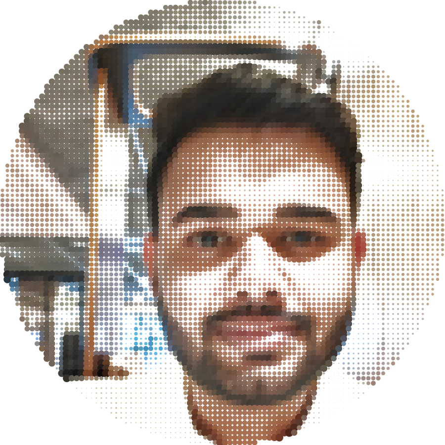
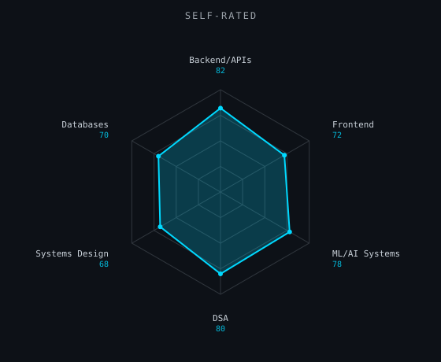
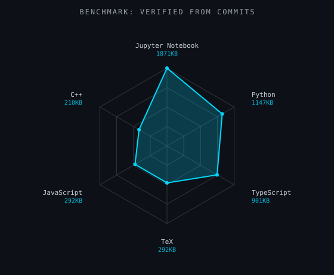
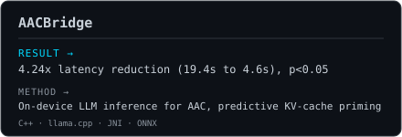
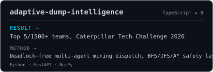
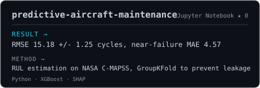
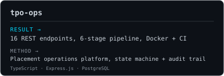

<div align="center">



<br/>


<br/>


</div>

---

```
CSE @ VIT Vellore (2023–2027)  ·  CGPA 9.21  ·  Merit Scholar
Co-Inventor — Indian Patent Application 202641025497
```

The Greeks once asked a question about a ship repaired so many times that none of its original timber remained:

Was it still the same ship?

Production systems ask the same question differently — through race conditions, silent rewrites, and the slow replacement of everything that once made them work.

I'm Arjit. Still replacing parts. Still learning what survives.

---

## Work

**Software Engineering Intern — GatiSoftTech** *(May 2026 – Jul 2026)*

Built EcoAgent, an R&D proof-of-concept for LLM-assisted HVAC energy optimization, with deterministic safety checks between model decisions and EnergyPlus actuators. Profiled a 59s simulation/control cycle, traced the bottleneck to verbose local-LLM generation, and tightened it to ~12s — enabling four reasoning cycles within the 62s simulation window.

**Software Development Intern — Aspire For Her Foundation** *(Dec 2025 – Feb 2026)*

Built an RBAC-enforced multi-tenant dashboard and integrated Cashfree HMAC webhook verification for 300+ users, while establishing GitHub Actions CI/CD peer-review gates after executing a live git-based production rollback.

**Research Intern — India Space Lab** *(Jun – Jul 2025)*

Engineered automated telemetry ingestion ETL pipelines for 15+ flight stability parameters across multi-channel sensor streams, resolving real-world signal noise and data integrity failures while capturing 3 flagged anomalies to cut manual review overhead.

---

## Recognition

-FF9900?style=flat-square) 

---

## Capability Benchmark

<table><tr>
<td width="50%" align="center">
<picture>
  <source media="(prefers-color-scheme: dark)" srcset="assets/radar-dark.svg">
  <source media="(prefers-color-scheme: light)" srcset="assets/radar-light.svg">
  
</picture>
</td>
<td width="50%" align="center">
<picture>
  <source media="(prefers-color-scheme: dark)" srcset="assets/radar-langs-dark.svg">
  <source media="(prefers-color-scheme: light)" srcset="assets/radar-langs-light.svg">
  
</picture>
</td>
</tr></table>

<sub>Left: self-rated. Right: pulled live from repo language bytes — refreshed daily.</sub>

---

## Verified Results

<table><tr>
<td width="50%">
<picture>
  <source media="(prefers-color-scheme: dark)" srcset="assets/card-aacbridge-dark.svg">
  <source media="(prefers-color-scheme: light)" srcset="assets/card-aacbridge-light.svg">
  
</picture>
</td>
<td width="50%">
<picture>
  <source media="(prefers-color-scheme: dark)" srcset="assets/card-adaptive-dump-intelligence-dark.svg">
  <source media="(prefers-color-scheme: light)" srcset="assets/card-adaptive-dump-intelligence-light.svg">
  
</picture>
</td>
</tr><tr>
<td width="50%">
<picture>
  <source media="(prefers-color-scheme: dark)" srcset="assets/card-predictive-aircraft-maintenance-dark.svg">
  <source media="(prefers-color-scheme: light)" srcset="assets/card-predictive-aircraft-maintenance-light.svg">
  
</picture>
</td>
<td width="50%">
<picture>
  <source media="(prefers-color-scheme: dark)" srcset="assets/card-tpo-ops-dark.svg">
  <source media="(prefers-color-scheme: light)" srcset="assets/card-tpo-ops-light.svg">
  
</picture>
</td>
</tr></table>

---

## Projects

**AAC Bridge — On-Device LLM Inference**

`C++ · llama.cpp · ONNX · JNI`

Engineered an on-device inference pipeline (llama.cpp, MiniLM/ONNX) with JNI synchronization and KV-cache serialization, cutting 500-token response latency from 19.4s to 4.6s (4.24×, Welch t-test p<0.05) — submitted to IEEE Access.

---

**ADIOS — Autonomous Dump Orchestration System**

`Python · FastAPI · BFS/DFS · Next.js`

 

Engineered a deadlock-free multi-agent orchestration pipeline by integrating a 3D reservation grid, 25-tick DFS wait-for graph lookahead, and BFS flood-fill terrain validation to secure concurrent dispatching for 4 trucks without polygon entrapment.

---

**Predictive Maintenance — Aircraft Engine RUL**

`Python · XGBoost · scikit-learn · SHAP`


Engineered a degradation-aware RUL prediction pipeline on 21-channel NASA C-MAPSS telemetry using XGBoost with 44 handcrafted features and GroupKFold validation, optimizing around asymmetric failure-cost penalties to achieve RMSE 15.18 ± 1.25 and near-failure MAE of 4.57.

---

**Industrial Hydraulic Fault Diagnosis**

`FastAPI · PyTorch · 17-Channel Sensor Data`


Designed FastAPI-served PyTorch inference pipelines over 17-channel hydraulic sensor data with hardened signal preprocessing and integrity validation, achieving 0.994 macro-F1 across fault classes.

---

## Stack

```
Languages  →  C++, Python, Java, JavaScript, SQL
Backend    →  FastAPI, Node.js, Express.js, Docker, Celery, Redis, JWT
Databases  →  MongoDB, SQLite
AI/ML      →  PyTorch, YOLOv8, XGBoost, scikit-learn, OpenCV, SHAP
Core CS    →  Data Structures & Algorithms, Operating Systems, DBMS, Computer Networks
```

---

<div align="center">


<br/>

[](https://arjittripathi.vercel.app)
[](https://www.linkedin.com/in/arjit-tripathi-213b4a292/)
[](mailto:arjittripathi3103@gmail.com)
[](https://github.com/omni-ar)

<br/>

<sub><i>कर्मण्येवाधिकारस्ते मा फलेषु कदाचन — Gita 2.47</i></sub>

<br/>

<sub>You have the right to perform your duty, not to the fruits of your actions.</sub>

</div>
